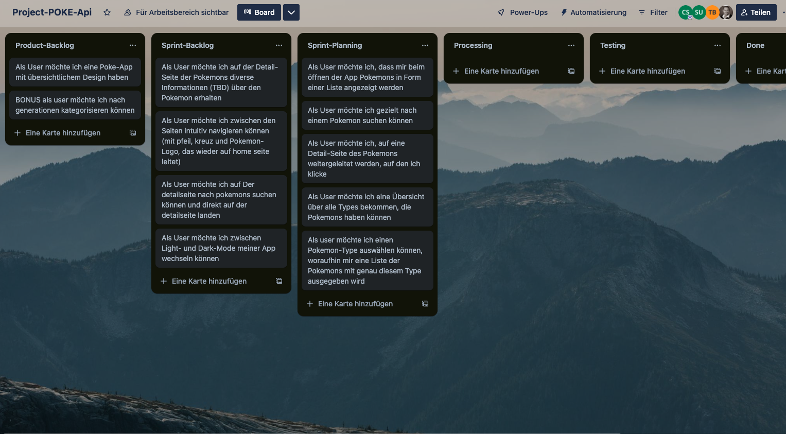
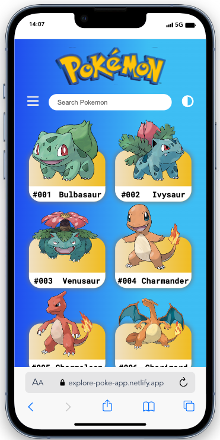
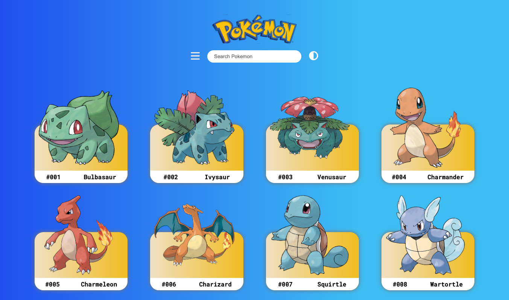
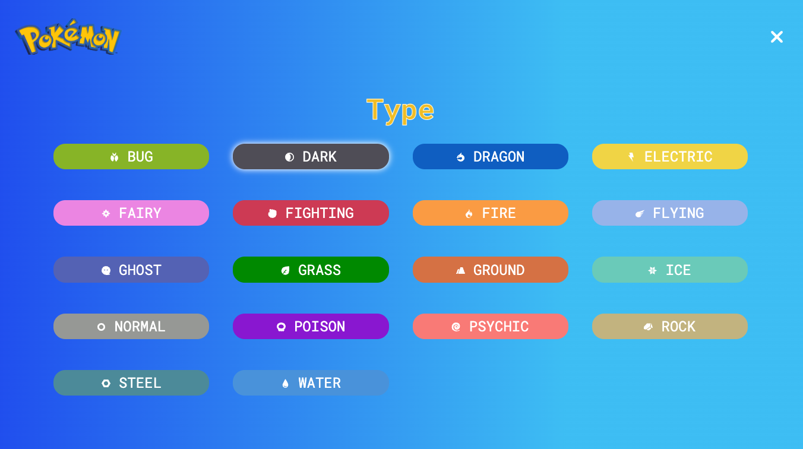

# Poke-API / React Project

- This project was created as part of a Full-Stack Webdeveloper bootcamp from supercode.
- we worked on the project in a group of four
- We had two days to plan and implement the project, after which we presented it to the entire course

- The learning objective of the project:
- plan and implement a larger project in the group
- git workflow in a group
- internalize the handling of useState-, useEffect- and useContext-hooks in react
- the dynamic creation of detail pages using an API and the react npm package: react-router-dom

## How does the Poke-App work?

- On the home page the user gets an overview of all pokemons of the first generation
- if the user clicks on a pokemon, he is redirected to a detail page that provides more information about the pokemon
- the user can search for a specific pokemon in the search bar
- the user can apply various filters to display only pokemons of a certain type

## Demo Link

https://explore-poke-app.netlify.app

## Screenshot of our trello board at the beginning 📸

## Screenshots of the Poke-App 📸

## Copatible Screensizes

- optimized for mobile use but usable on every screen

## Tech Stack 💻

- react
- HTML
- SCSS
- vite
- GitHub
- netlify
- JavaScript
- Trello
- Figma
- GIT
- REST API (Poke API)

## Authors 🤵‍♀️🦹🏽🧑‍🏭🦸‍♂️

- [@wilhelm-lenz](https://github.com/wilhelm-lenz)
- [@SuperCoderSuat](https://github.com/SuperCoderSuat)
- [@trisi99](https://github.com/trisi99)
- [@cecilestaller](https://github.com/cecilestaller)

## API-Link

https://pokeapi.co/
